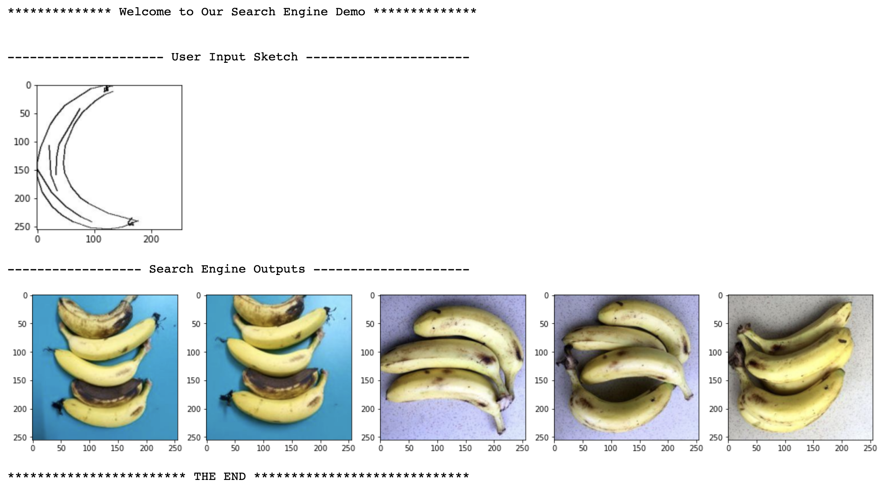
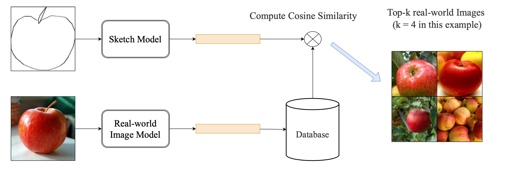

# Search Real-world Fruit Images based on user-input Sketch

CS5242 Project: Search Real-world Fruit Images based on user-input Sketch

The folder has the following structure:

-- Project
------ model \
------ fig \
------ results \
------ data \
------ some notebooks (including our report.ipynb, and each implemented model is in one notebook)\

model: includes pre-trained model of MLP, CNN, CNN with contrastive loss, Inception. Notice that if you want to use ResNet and VGG16 pretrained model, please download them from the link we provided in the beginning of report.ipynb.

results: the training and testing results of each model we implemented.

fig: figures we need in our report.

data: preprocessed dataset (should include 4 npz files, we provide download link for it). 

## IMPORTANT NOTICE:

Proprocessed Dataset (npz files): https://drive.google.com/drive/folders/1mBAQHd7LpmIkIQUAmsPUjsbVWdUhq991?usp=sharing \
Pretrianed Model: https://drive.google.com/drive/folders/1qVvAIaXa6U-0eh0fJ_9kNX9IGAFfC7S6?usp=share_link

Here is the demo of our sketch-based image search engine:

We propose to use Neural Network to extract features in images and compute cosine similarities for image features. In this project, two models  $M_{realworld}$ and $M_{sketch}$ are trained to find good representations for real-world image and sketch image. For $M_{realworld}$ and $M_{sketch}$ , we tried MLP, ResNet, VGG, Inception and CNN to solve the problem. We analyze these model performance in the following sections. 

we improve CNN performance by introducing contrastive loss. The model structure is as follows: 

The goal of contrastive loss is to discriminate the features of the input vectors. We will pull together the features from the same class, and push away the features from the different class. The formula of  Contrastive Loss is: . 

$\text { loss }=-\log \frac{\sum_{\text {label}_{i} = \text { label }_j} \exp \left(\operatorname{sim}\left(f_i, f_j\right) / \tau\right)}{\sum_k \exp \left(\operatorname{sim}\left(f_i, f_k\right) / \tau\right)}$

where $f$ represents image features and $\tau$ represents temperature in Contrastive loss formula.

We add three CL losses in CNN, shown in above figure with orange, blue and grean color. We use $M$ represents Model and $x$ represents input images.

In CL loss1, $f = f_{realworld} = M_{realworld}(x_{realworld})$ represents image features of real-world images.

In CL loss2, $f = f_{sketch} = M_{sketch}(x_{sketch})$ represents image features of sketch images.

In CL loss3, $f = f_{realworld} \times f_{sketch}$ represents the product of real-world image featrues and quickdraw image featrues.

Loss 3 is important because it takes the product of the real-world image feature and sketch images, which means it will pull together the real-world images and sketch images with the same label. It can significantly improve our search engine performance.
